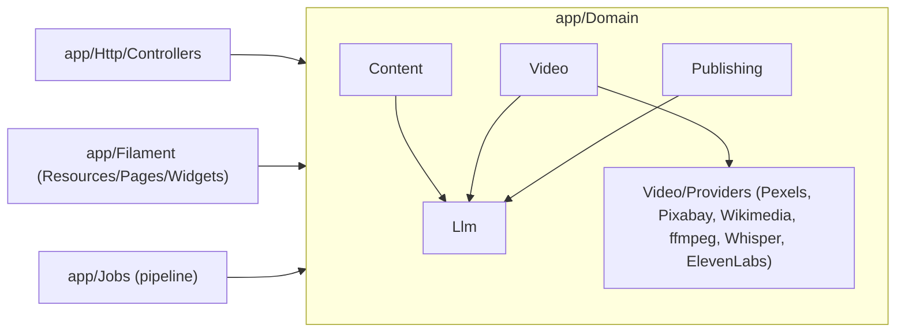

# Архітектура

Короткий довідник по тому, як влаштований код. Для того, як користуватись
застосунком — `docs/GUIDE.md`. Для тестів — `docs/testing.md`.

Інтерактивна версія розділів 1–3 нижче: `/console/architecture` (Modules/Pipeline/Providers).

## 1. Доменна модель (`app/Domain`)

Код організований DDD-стилем, по bounded contexts, а не по MVC-шарах:

- **`Content`** — генерація ідей і сценаріїв (`GenerateScriptService` та ін.).
- **`Llm`** — абстракція над LLM-провайдерами (`LlmManager`, `LlmProviderInterface`,
  провайдери `OpenAiLlmProvider` / `DeepSeekLlmProvider` / `AnthropicLlmProvider` /
  `FakeLlmProvider`).
- **`Video`** — найбільший контекст: сцени, озвучка, асети, субтитри, рендер,
  quality-check. Сервіси в `Video/Services/*`, зовнішні інтеграції в
  `Video/Providers/*`.
- **`Publishing`** — публікація відео в соцмережі (`FakeSocialPublisher` —
  реальної інтеграції ще нема, див. `docs/GUIDE.md` розділ "чого поки немає").

Кожен контекст: `Services/` (доменна логіка), `Providers/` (адаптери до
зовнішніх API/CLI, кожен з `Fake*`-двійником для тестів), `Exceptions/`
(доменні винятки).

`app/Http`, `app/Filament`, `app/Jobs` — тонкі шари, які викликають доменні
сервіси/провайдери, а не містять бізнес-логіку самі.



## 2. Pipeline генерації відео

Немає центрального оркестратора — це **ланцюжок Jobs**: кожен job у
`handle()` сам диспатчить наступний після успіху, і сам позначає
`Video::failed_stage` + шле `PipelineJobFailedNotification` при остаточному
провалі (trait `NotifiesOnPermanentFailure`, після вичерпання `tries`).

```mermaid
flowchart TD
    A[GenerateScriptJob] -->|ContentIdea -> Script| B[GenerateScenesJob]
    B -->|Script -> Video + VideoScene[]| C[GenerateVoiceoverJob]
    C -->|Voiceover| D[CollectVideoAssetsJob]
    D -->|MediaAsset[] по сценах| E[GenerateSubtitlesJob]
    E -->|Whisper -> subtitles| F[RenderVideoJob]
    F -->|ffmpeg -> file_path| G[QualityCheckVideoJob]
    G -->|quality_passed / quality_report| H((чекає ручного Approve в адмінці))
    H --> I[DispatchDuePublicationsCommand<br/>scheduler, кожну хвилину]
    I -->|Publication.scheduled_at <= now| J[PublishVideoJob]
    J --> K[FakeSocialPublisher]
```

Статуси йдуть по `VideoStatus` enum: `Draft` → `ScriptGenerated` →
`VoiceGenerated` → `AssetsReady` → `Rendering` → `Rendered` → `Approved` →
`Scheduled` → `Publishing` → `Published` (або `Failed` на будь-якому кроці,
з `failed_stage` = одна з `scenes|voiceover|assets|subtitles|render|quality_check`,
що показується в адмінці колонкою **Stage** з кнопкою **Retry**).

`GenerateCaptionsJob` — окремий, поза основним ланцюжком: диспатчиться
вручну з `PublicationsTable` (генерує текст підпису для конкретної
`Publication`, не для `Video`).

## 3. Provider-чейни

Зовнішні джерела для одного й того ж запиту пробуються по черзі, поки
хтось не поверне результат — патерн `Chained*Provider`, конфігурований у
`config/*.php` і забінджений у відповідному `*ServiceProvider::register()`.

| Що | Клас-обгортка | Порядок (`config`) | Провайдери |
|---|---|---|---|
| B-roll асети | `ChainedAssetProvider` | `config('assets.chain')` = `[wikimedia, pixabay, pexels, local]` | Wikimedia йде першим — єдине джерело класичного мистецтва для історичних/філософських сцен; далі комерційні stock, і `local`-медіатека як фолбек |
| LLM | `LlmManager::resolve()` | `providerOverride` → налаштування каналу (`purpose`) → дефолт каналу → `config('llm.default_provider')` | `openai`, `deepseek`, `anthropic`, `fake` (тести) |

Кожен провайдер має `Fake*`-двійник (`FakeAssetProvider`, `FakeLlmProvider`,
`FakeTtsProvider`, `FakeTranscriptionProvider`, `FakeVideoRenderer`,
`FakeVideoQualityChecker`, `FakeAudioProbe`, `FakeSocialPublisher`) — саме
вони підставляються в тестах (`Http::preventStrayRequests()` +
`Process::preventStrayProcesses()` в `tests/TestCase.php` фізично забороняють
живі виклики).

## 4. Моделі й статуси

Основний ланцюжок сутностей: `ContentProject` → `ContentIdea` → `Script` →
`Video` → (`VideoScene[]`, `Voiceover`, `MediaAsset[]`) → `Publication` →
`SocialAccount`. `VideoMetric` і `LlmUsageLog` — телеметрія (перегляди/лайки
з площадок, вартість LLM-викликів).

Enum'и статусів у `app/Models/Enums/*`: `ContentIdeaStatus`, `ScriptStatus`,
`VideoStatus`, `VoiceoverStatus`, `PublicationStatus`, `LlmUsageLogStatus`.

## 5. Адмінка

Зараз — Filament 4 (`app/Filament/{Resources,Pages,Widgets}`,
`app/Providers/Filament/AdminPanelProvider.php`), по одному Resource на
модель. Ресурси — тонкий UI-шар: складна логіка (наприклад "Generate Video"
кнопка) викликає доменні сервіси/jobs, не містить бізнес-логіки сама.

> Якщо ти читаєш це після заміни адмінки на Inertia+React — онови цей
> розділ і познач Filament-шлях як історичний.
